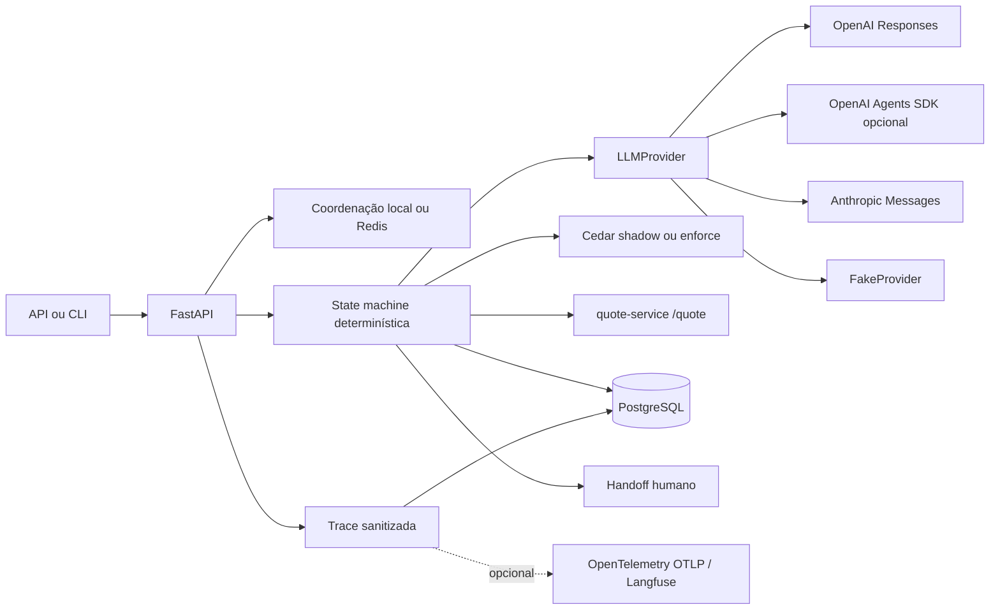

# AutoSeguro Agent

Solução local auditável para o desafio FDE da Namastex. O agente qualifica o lead, confirma os dados e apresenta somente preços retornados por `POST /quote`. A state machine determinística mantém autoridade sobre transições, retries, preço, handoff, persistência e side effects. O modelo apenas extrai dados e classifica intenção.

## Caminho mínimo sem chamada paga

Este foi o caminho nativo validado no macOS; Docker Compose permanece uma alternativa com
validação somente estática nesta entrega.

```bash
brew install postgresql@17 redis
brew services start postgresql@17
/opt/homebrew/opt/postgresql@17/bin/createuser --createdb autoseguro
/opt/homebrew/opt/postgresql@17/bin/createdb --owner=autoseguro autoseguro
/opt/homebrew/opt/postgresql@17/bin/psql -d postgres \
  -c "ALTER USER autoseguro WITH PASSWORD 'autoseguro';"

cd agent-service
uv sync --extra dev --extra redis --extra observability --extra policy --extra agents
cp .env.example .env
.venv/bin/alembic upgrade head
```

Em um terminal, suba o serviço legado. Em outro, execute a demo com provider determinístico,
sem credencial e sem chamada paga:

```bash
agent-service/.venv/bin/uvicorn app.main:app --app-dir quote-service --port 8000
```

```bash
cd agent-service
LLM_PROVIDER=fake .venv/bin/autoseguro demo \
  --output ../artifacts/demo-conversation.jsonl
```

O resultado esperado é estado `completed`, uma única tentativa HTTP 200 e preço idêntico
ao payload validado do quote-service. O artifact JSONL e a trace sanitizada ficam em
`artifacts/`.

## Régua do desafio

| Requisito | Risco | Mecanismo | Evidência |
| --- | --- | --- | --- |
| Atendimento ponta a ponta | estado incoerente | state machine explícita | E2E OpenAI e testes de service |
| Preço oficial | valor inventado | schema do upstream e tentativa HTTP 200 | trace live, banco isolado e testes contratuais |
| Falha segura | preço em timeout/erro | retry allowlist e handoff | testes negativos e campanha seeded |
| Concorrência | duas cotações | idempotency key e lock por sessão | testes de API/Redis |
| Rastreabilidade | eventos órfãos | IDs de request, trace, sessão, mensagem, evento e quote | endpoint `/trace` e traces live |
| Privacidade | PII ou token persistido | redaction anterior ao LLM/persistência e token com hash | scans de PostgreSQL, Redis, traces e artifacts |
| Autoridade determinística | side effect probabilístico | modelo limitado a `AgentDecision` | providers sem tools de cotação |

## Arquitetura



O `quote-service/` legado foi preservado. O dataset sintético é usado para avaliar extração, mídia e redaction; seus preços aleatórios não alimentam prompts, cache nem respostas. O runtime não é multi-agent. Handoff humano é um estado de negócio, sem handoff do OpenAI Agents SDK.

Componentes:

- `agent-service/`: FastAPI, CLI, state machine, providers, coordenação, policy, telemetry e testes.
- `policies/`: schema e políticas Cedar validados pelo engine real.
- `agent-service/evals/`: casos adversariais de cache e traces rotuladas da eval-fleet.
- `artifacts/`: demo, trace, benchmarks e relatórios agregados sem PII.
- `ai-logs/`: export sanitizado da sessão Codex e sanitizador reproduzível.
- `docs/adr/`: decisões de Redis, observabilidade, Cedar, cache, pgvector, Agents SDK e eval-fleet.

## Setup local

Requisitos usados nesta validação: PostgreSQL 17, Redis, Python `>=3.11` e `uv 0.12.7`
(a mesma versão fixada na CI).

Confirme a versão com `uv --version`. O número da versão não faz parte da sintaxe do
comando; mesmo com `uv 0.12.7` instalado, a invocação correta começa com `uv sync`.

```bash
brew install postgresql@17 redis
brew services start postgresql@17
brew services start redis

/opt/homebrew/opt/postgresql@17/bin/createuser --createdb autoseguro
/opt/homebrew/opt/postgresql@17/bin/createdb --owner=autoseguro autoseguro
/opt/homebrew/opt/postgresql@17/bin/psql -d postgres \
  -c "ALTER USER autoseguro WITH PASSWORD 'autoseguro';"

cd agent-service
uv sync --extra dev --extra redis --extra observability --extra policy --extra agents
cp .env.example .env
.venv/bin/alembic upgrade head
```

As credenciais do exemplo são exclusivamente locais. Produção requer secret manager, TLS, retenção definida, rotação e identidade mais forte que o capability token por sessão.

```bash
agent-service/.venv/bin/uvicorn app.main:app --app-dir quote-service --port 8000
```

```bash
cd agent-service
LLM_PROVIDER=fake COORDINATION_BACKEND=redis \
  .venv/bin/uvicorn autoseguro.api:app --port 8080
```

`docker-compose.yml` contém PostgreSQL 17, Redis, quote-service e agent-service. Docker não estava instalado nesta revisão; o Compose teve inspeção estática e não deve ser tratado como executado localmente.

## Providers

`LLM_PROVIDER` aceita `fake`, `openai`, `anthropic` e `agents_sdk`. O padrão configurado é `openai` com `gpt-5.4-mini`.

```bash
export OPENAI_API_KEY="..."
export LLM_PROVIDER=openai        # ou agents_sdk
export LLM_MODEL=gpt-5.4-mini
```

O `AgentsSDKProvider` usa um único `Agent`, structured output `AgentDecision`, nenhuma tool, nenhum handoff e `max_turns=1`. Recebe apenas mensagem sanitizada, estado e dados mínimos. Não pode chamar `/quote`, calcular preço, persistir ou alterar estado. O tracing nativo fica desabilitado para evitar duplicidade com OpenTelemetry; `trace_include_sensitive_data=False` e o trace ID canônico ainda fazem parte do `RunConfig` testado.

O adapter foi testado com `openai-agents==0.22.0`, mocks e API real. Na campanha `live_20260831t204700z`, ambos os happy paths chegaram a `completed` com uma cotação HTTP 200 e preço comprovadamente igual ao payload upstream. O AgentsSDKProvider registrou um `APIConnectionError` sem status em um turno, tratado pelo fallback determinístico; por isso ele permanece opcional e não é recomendado como default. Anthropic permanece coberto somente por mocks.

Os artifacts identificam os snapshots `gpt-5.4-mini-2026-03-17` e
`gpt-5.4-2026-03-05`. Reasoning effort não foi enviado explicitamente nem registrado na
campanha. A documentação atual informa default `none` para ambos; isso permite uma inferência
sobre a execução, sem fornecer evidência request-level do parâmetro efetivo.

## API e CLI

```bash
curl -s -X POST http://localhost:8080/v1/sessions
```

A resposta entrega `session_token` uma única vez. Somente o hash SHA-256 é persistido. Mensagens exigem o token e uma idempotency key por operação lógica:

```bash
curl -s -X POST "http://localhost:8080/v1/sessions/${SESSION_ID}/messages" \
  -H "x-session-token: ${SESSION_TOKEN}" \
  -H 'idempotency-key: message-0001' \
  -H 'content-type: application/json' \
  -d '{"content":"Toyota Corolla 2022","message_type":"text"}'
```

Repetir chave e payload retorna a mesma resposta. Reutilizar a chave com payload diferente retorna HTTP 409. O lock curto por sessão impede processamento e cotação concorrentes.

```bash
curl -s -H "x-session-token: ${SESSION_TOKEN}" \
  "http://localhost:8080/v1/sessions/${SESSION_ID}"
curl -s -H "x-session-token: ${SESSION_TOKEN}" \
  "http://localhost:8080/v1/sessions/${SESSION_ID}/trace"
curl -s http://localhost:8080/health
```

```bash
cd agent-service
.venv/bin/autoseguro chat --provider openai
.venv/bin/autoseguro demo --provider fake --output ../artifacts/demo-conversation.jsonl
```

A demo também gera `artifacts/demo-conversation-trace.json` com transições, quote attempts e eventos técnicos sanitizados.

## Redis e degradação explícita

| Controle | Redis indisponível | Motivo |
| --- | --- | --- |
| Rate limiting compartilhado | limiter local e `X-Control-Degraded` | preserva disponibilidade e expõe perda de coordenação horizontal |
| Idempotência | fail closed, HTTP 503 | prosseguir poderia duplicar cotação e resposta |
| Lock por sessão | fail closed, HTTP 503 | prosseguir permitiria transições concorrentes |
| Circuit breaker | fail open, com warning | timeout, retries e handoff ainda limitam a falha |

Chaves Redis usam SHA-256, recebem prefixo configurável por `REDIS_KEY_PREFIX` e os valores de idempotência contêm apenas resposta sanitizada. A campanha live usou namespace exclusivo por `RUN_ID` em uma instância efêmera dedicada. A garantia não cobre falha do processo depois que o quote-service aceita a requisição, pois o endpoint legado não recebe idempotency key upstream. O ADR 0001 documenta esse limite.

## Fluxo, retries e handoff

Estados: `qualification`, `plan_selection`, `confirmation`, `quoting`, `quote_presented`, `completed` e `handoff`.

Timeouts, erros de transporte e HTTP 500/502/503 recebem até três tentativas, timeout de três segundos e backoff exponencial com jitter. HTTP 400 e 422 não são repetidos. Cada tentativa registra `quote_id`, número, status, HTTP status, duração e categoria de erro. `quote_id` identifica a operação local; o quote-service legado não devolve ID próprio. A proveniência exige esse ID local, tentativa HTTP 200 e payload upstream validado, cujo preço deve ser idêntico ao apresentado.

Handoff ocorre por pedido explícito, mídia sem transcrição, ambiguidade persistente, recusa de elegibilidade, payload inválido, falha esgotada, policy deny em ENFORCE ou negociação depois da proposta. Falhas de cotação produzem explicação segura sem preço estimado.

## Cedar policy as code

Cedar autoriza `CallLLM`, `CallQuote`, `PersistAudit`, `CompleteSession` e `HandoffSession` com principal, action, resource e context tipados e default deny. `CallQuote` exige estado de confirmação, dados completos, confirmação, sanitização e destino `quote-service`.

O padrão `POLICY_MODE=shadow` observa e registra Allow/Deny, sem constituir enforcement ativo. `POLICY_MODE=enforce` pode bloquear `POLICY_ENFORCE_ACTIONS`; indisponibilidade do engine bloqueia `CallQuote` e gera handoff seguro. Cedar foi executado com schema e policy reais por `cedarpy 4.8.7`, binding comunitária do engine Rust. “Semantic firewall” é apenas analogia; Cedar não detecta alucinação.

## Observabilidade e privacidade

CPF, e-mail, telefone, placa e CEP completo são mascarados antes da persistência, do LLM e da exportação. Apenas o prefixo de dois dígitos do CEP é retido. O sistema não solicita documentos, CPF ou telefone.

Cada mensagem cria uma trace com `correlation_id`, `message_id`, `session_id` e `canonical_trace_id`; cada evento persistido possui `event_id`. Há spans para autorização, redaction, LLM, fallback, transição, Cedar, quote attempts e handoff ou completion. Provider, modelo, versões de prompt/schema, duração, usage, status, erro e cache status são permitidos. Raw prompt, raw response, conteúdo, capability token e PII são bloqueados client-side.

Eventos sanitizados são persistidos no PostgreSQL e retornados por `/trace`. OpenTelemetry OTLP é opcional e desabilitado por padrão. Um endpoint compatível, inclusive Langfuse, pode ser configurado sem infraestrutura self-hosted no Compose. Falha de inicialização ou exportação não interrompe a aplicação. O exporter foi testado com receiver protobuf local e endpoint indisponível. Nenhum servidor Langfuse foi executado, logo Langfuse permanece compatibilidade arquitetural sem validação operacional.

## Eval-fleet offline

`QuoteIntegrityEvaluator`, `PrivacyEvaluator`, `HandoffEvaluator` e `ResilienceEvaluator` processam somente `SanitizedTrace`, sem tools ou side effects. Cada resultado inclui `passed`, `score`, `findings`, `evidence_event_ids`, latência, tokens e custo. Avaliações independentes rodam em paralelo; agregação e ordenação são determinísticas.

```bash
cd agent-service
.venv/bin/python scripts/evaluate_fleet.py
```

Em dez traces sintéticas rotuladas, o baseline teve concordância `0,90`, quatro falsos negativos e zero falsos positivos. A fleet determinística teve concordância `1,00`, zero falsos positivos, zero falsos negativos e encontrou quatro defeitos adicionais de handoff/resiliência, com zero LLM calls, tokens e custo. A fleet avalia invariantes das traces e não substitui as invariantes programáticas. LLM judges continuam rejeitados por falta de ganho diagnóstico calibrado.

## Dataset, cache e benchmark

`artifacts/dataset-evaluation.json` registra 26.470 mensagens, 2.500 conversas, 5.621 mensagens com PII detectável, zero vazamentos após redaction, 100% de acurácia para idade/ano no padrão sintético e 1.789 mídias encaminháveis. Esses números não demonstram desempenho em conversas reais.

Semantic cache foi rejeitado: no proxy adversarial, o namespace completo ainda teve unsafe false-hit rate `0,5833`. Nenhum cache de decisão foi implementado. `pgvector` foi rejeitado porque não houve hipótese de retrieval com ganho medido; nenhum índice ou vector store foi criado.

`artifacts/baseline-vs-enabled.json` compara 100 iterações na última regeneração local:
baseline p50 `4,878 ms`, p95 `5,922 ms`; OpenTelemetry em memória mais Cedar shadow p50
`5,504 ms`, p95 `8,853 ms`; equivalência `100/100`; 100 chamadas determinísticas por
variante; tokens indisponíveis; cache hit rate zero. O p95 é descritivo e não define SLA.
Redis, exportação OTLP, Langfuse e LLM real ficaram fora desse benchmark.

## Custo, latência e escolha do default

A campanha live respeitou os limites: 18 de 20 tentativas HTTP, 9.404 de 30.000 tokens,
USD 0,0140915 de USD 1,00, 31,181 de 600 segundos pagos e 1.555,721 de 1.800 segundos
totais. Todas as requests tinham timeout de 20 segundos e retries internos dos SDKs estavam
desabilitados. Uma falha sem usage consumiu a reserva conservadora de 1.000 input e 300
output tokens; não foi contabilizada como custo zero.

As tarifas usadas, verificadas em 31 de agosto de 2026, foram: GPT-5.4 mini USD 0,75/M
input, USD 0,075/M cached input e USD 4,50/M output; GPT-5.4 USD 2,50/M input,
USD 0,25/M cached input e USD 15/M output. Cached input não foi capturado nos artifacts,
portanto todo input foi cobrado conservadoramente pela tarifa integral. Fontes:
[GPT-5.4 mini](https://developers.openai.com/api/docs/models/gpt-5.4-mini) e
[GPT-5.4](https://developers.openai.com/api/docs/models/gpt-5.4).

Nas 18 tentativas, mínimo, mediana, máximo e p95 nearest-rank descritivo foram 8 ms,
1.413 ms, 4.646 ms e 4.646 ms. O mínimo corresponde ao `APIConnectionError` do Agents SDK.
Nas 17 respostas bem-sucedidas, os valores foram 841 ms, 1.504 ms e 4.646 ms. Essa amostra
pequena não sustenta SLA.

O happy path do provider direto custou USD 0,001662 em três decisões. Se 100% das sessões
repetirem exatamente esse fluxo de três turnos, sem cache, evals, judges ou infraestrutura,
a projeção é USD 1,662 para 1.000 sessões e USD 166,20 para 100.000. Os evals live custaram
USD 0,004977; a comparação com GPT-5.4, USD 0,00368; judges custaram zero porque foram
rejeitados e não executados. O custo médio foi USD 0,000783 por tentativa HTTP e
USD 0,000829 por decisão estruturada bem-sucedida.

Na comparação de snapshots, duas observações por modelo produziram decisões equivalentes
para injection e negociação. A mediana foi 1.281,5 ms no mini e 2.953,5 ms no GPT-5.4.
Nenhum ganho mensurável justificou o modelo mais caro. Na comparação de adapters, as quatro
decisões rotuladas equivalentes tiveram qualidade igual, mas apenas o provider direto
concluiu o E2E; por confiabilidade e menor superfície, ele permanece o default recomendado.

## Testes e CI

```bash
cd agent-service
.venv/bin/ruff format --check .
.venv/bin/ruff check .
.venv/bin/mypy --strict src/autoseguro
.venv/bin/pytest -ra
.venv/bin/pip-audit
cd ..
gitleaks dir . --redact=100
```

`.github/workflows/ci.yml` executa Ruff, mypy strict, Alembic do zero, pytest com PostgreSQL 17 e Redis, `pip-audit` e Gitleaks. A execução remota final foi concluída com sucesso; Actions estão fixadas por SHA e permissões são somente leitura.

## Evidências de validação

- Validado localmente: Ruff, mypy strict em 19 módulos, Alembic `20260831_0004` partindo de banco vazio, PostgreSQL e Redis locais, `pip-audit` e 80 testes de integração completos.
- Validado contra OpenAI real: a campanha `live_20260831t204700z` consumiu 17 tentativas HTTP, 8.934 tokens, USD 0,0135365 estimados e 27,325 s. OpenAIProvider e AgentsSDKProvider concluíram seus happy paths com uma cotação HTTP 200 cada; a falha transitória do SDK permanece registrada no artifact sanitizado.
- Comparação live: `gpt-5.4-mini-2026-03-17` e `gpt-5.4-2026-03-05` foram executados nos mesmos casos de injection e negociação. A amostra tem duas observações por snapshot e não sustenta superioridade estatística; p95 é apenas descritivo onde reportado.
- Testado com mocks: Anthropic, falhas 400/422/500/502/503, timeout, conexão recusada, circuit breaker, Redis indisponível, Cedar deny/fail-closed, concorrência, idempotência, fallback e observabilidade indisponível.
- Não executado: Docker, Langfuse operacional e Anthropic real.
- Semantic cache e pgvector permanecem rejeitados. A instabilidade real foi executada somente com seed `4242`; não houve amostra sem seed.

A regressão completa de release executou 80 testes com PostgreSQL e Redis reais, sem skips.
Os casos anteriores permanecem cobertos pela suíte expandida. Evidências detalhadas, falhas
e limitações ficam em `artifacts/validation/20260831T033826Z/`. A publicação deste repositório
no GitHub faz parte da entrega; não há deploy de produção ou provisionamento externo.

O sistema reduz a superfície e o impacto de alucinações, especialmente sobre preço, e mede os cenários cobertos pelo corpus de eval. Isso não estabelece uma taxa mínima de alucinação nem uma garantia de produção.

## Índice de artifacts e arquivos públicos

Os arquivos centrais da campanha são:

- `manifest.json`, `live-budget.json` e `live-provider-results.json`: limites, runtime,
  tentativas, usage, custo e duração;
- `e2e-happy-openai.json` e `traces/openai.json`: fluxo concluído e correlação;
- `e2e-happy-agents-sdk.json`: falha segura e limite observado do adapter;
- `snapshot-comparison.json`: comparação dos modelos, sem inferência estatística;
- `negative-path-results.json` e `instability-report.json`: falhas determinísticas e seeded;
- `eval-results.json` e `eval-fleet-real-traces.json`: métricas separadas e o falso negativo;
- `pii-secret-scan-summary.json`: contagens por superfície, sem reproduzir valores;
- `artifacts/demo-conversation.jsonl`: conversa completa sanitizada com cotação;
- `ai-logs/codex-main-session-sanitized.jsonl`: log sanitizado da sessão principal de
  implementação, sem alegar totalidade das interações com todas as ferramentas de IA.

Destinam-se ao repositório público: código, testes, dataset fornecido, policies, evals,
ADRs, CI, Compose, artifacts fora das áreas locais e, em `ai-logs/`, apenas `README.md`,
`manifest.json`, `sanitize_codex_session.py` e `codex-main-session-sanitized.jsonl`.

Permanecem exclusivamente locais e ignorados: `.env`, `.venv`, caches, bancos, logs de
processo, `artifacts/backups/`, `artifacts/release-readiness/`, o JSONL original em
`~/.codex/sessions` e exports históricos auxiliares `ai-logs/codex-session*`.
